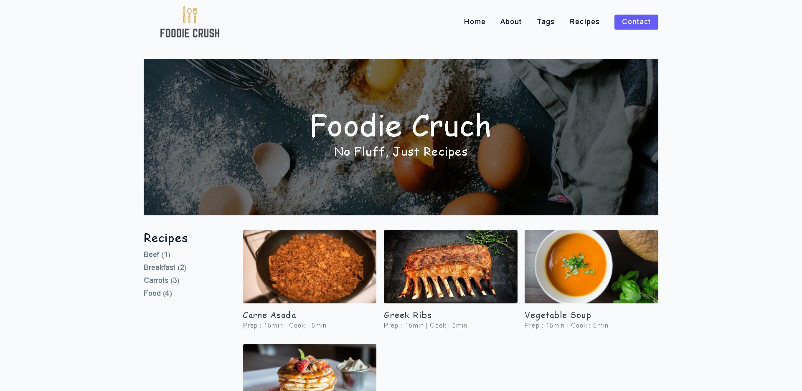

# <a>Foodie Crush</a>

<h3>Pug/Sass Structuring website 🤳</h3>

<menu>
  <li>Multi-pages website &amp; showcase</li>
  <li>Advanced Solid Environment Structure with Pug.js & SASS.</li>
  <li>rtl Support!</li>
  <li>Created Reusable Mixins.</li>
  <li>Fully responsive on each device even tinny mobiles.</li>
</menu>

   
   
TODO:

- [ ] add Arabic version.
- [ ] improve further animations

 
 
 
🤩 Leave a :star:&nbsp;if you like it, Please!

 

📫 Please hit me up at mohammed.yuossry@gmail.com if you have any feedback or improvements.
